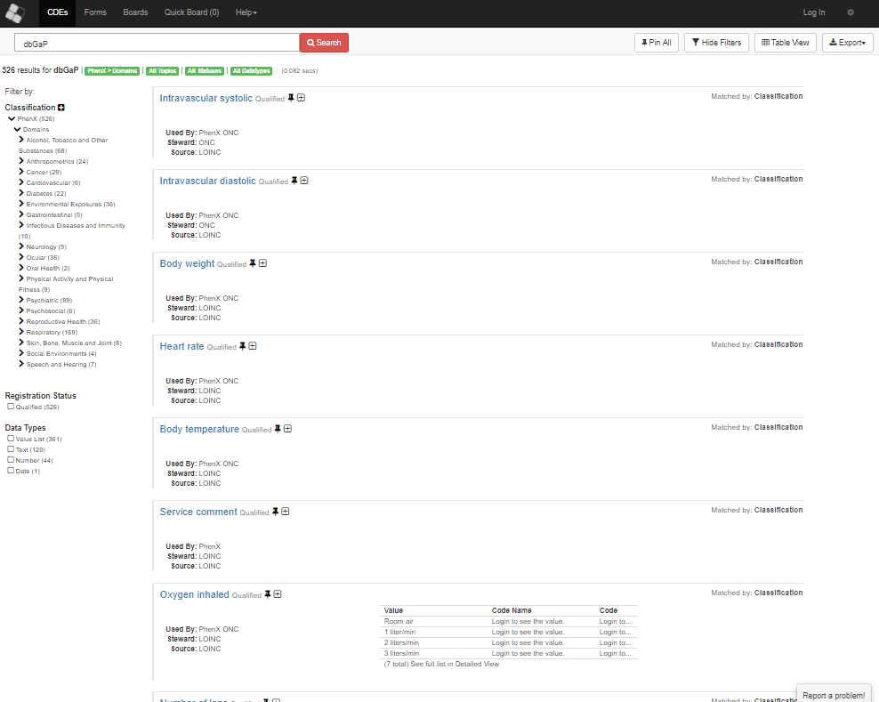

## Quick Start

Getting your json batch from CDE -> import to dbGaPdb (parse with python)-> list of studies (phs study accession) which have your data type:

```
dummy system call, python2 inst/scripts/CDE_lite_json.py data/CDE_Ocular.json
dummy load CDE into SQL, this function does not exist, will take output of .py script into SQL table
dummy example SQL query studies matching your Phenx list with datatype studyname from dbGaPdb and sequence type info from sradb
```

## NIH Common Data Elements (CDE)

NIH is currently producing Common Data Elements (cde.nih.nlm.gov) to harmonize the categories of data types present across studies available in their databases. This is currently implemented in dbGaP, and provides both a common naming terminology (often an amorphous concept) and *consensus measures for Phenotypes and eXposures (PhenX)* identifier. You can download a cross reference to dbGaP (phs study accession) and therefore SRAdb (sequence datatype) to define a set of studies in which that data parameter was taken, as well as other characteristics of those studies.

## How would you use this data?

Often a difficulty in determining studies of interest for analysis is knowing what metadata was collected in a given study. In our example case someone studying eye conditions can see that there are harmonized PhenX codes under "Ocular" for 36 data points--some obivously relevant, some less intuitive but still potentially significant--across 271 dbGaP accession variables. These include questions that are likely not asked in the same manner in every study. For example: "Do you have any retinal defects, retinal tears, detachments, etc" can be written many ways, but PX111001120000 is a definable identifier, and hits across four studies in dbGaP. Being able to tie this information into the other dbGaPdb resources can better tailor your metadata search to focus on studies worth your time. 

### Generating Data Table from exported json  

Currently there is not programatic access to CDE elements, so a batch file must be downloaded. You can go to the NIH CDE website https://cde.nlm.nih.gov/cde/search?selectedOrg=PhenX and search their PhenX terms for dbGaP. From the results you can stratify by category (on the left) and export a json (upper right corner). In this example, we selected the Ocular category to produce a sample subset "data/CDE_Ocular.json":



### Importing Table to dbGaPdb

The json exported from the website can be quickly parsed using the associated CDE_lite_json.py python script (tested in 2.7 and 3.6) and the output loaded in to dbGaPdb using the following commands:  

```
dummy system call, python2 inst/scripts/CDE_lite_json.py data/CDE_Ocular.json
```

the output file "CDE_table.tsv" can be imported

```
dummy load CDE into SQL, this function does not exist, will take output of .py script into SQL table
```

### Querying based on the new table

At this point, the primary key is the variable_accession (phv) is indexed to both the PhenX_ID and the Phenx text name. At this point the table can be queried with the standard dbGaP querying (See Intro_to_dbGaP_querying). For instance, if you wanted a list of studies associated with your data:

```
dummy example SQL query studies matching your Phenx list with datatype studyname from dbGaPdb and sequence type info from sradb
```
